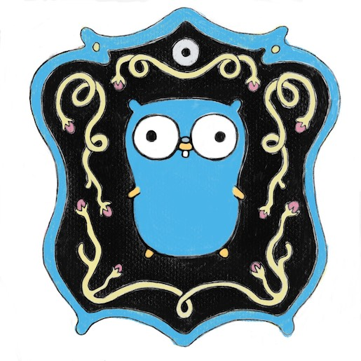

# Golang Development Environment Setting

If you need/want to have Golang development environment in Linux... \(+ vscode and delve\)

<br/><br/>

## Writer

* SJ Kim - <bus710@gmail.com>

<br/><br/>

## Referenece

* Golang Installation - [https://golang.org/doc/install](https://golang.org/doc/install)
* Go modules - [https://github.com/golang/go/wiki/Modules#quick-start](https://github.com/golang/go/wiki/Modules#quick-start)
* Delve Installation - [https://github.com/derekparker/delve/blob/master/Documentation/installation/linux/install.md](https://github.com/derekparker/delve/blob/master/Documentation/installation/linux/install.md)
* Golang and VSCODE - [https://code.visualstudio.com/docs/languages/go](https://code.visualstudio.com/docs/languages/go)
* Golang Debugging in VSCODE - [https://github.com/Microsoft/vscode-go/wiki/Debugging-Go-code-using-VS-Code](https://github.com/Microsoft/vscode-go/wiki/Debugging-Go-code-using-VS-Code)
* Vscode-go - [https://github.com/Microsoft/vscode-go](https://github.com/Microsoft/vscode-go)
* A comprehensive guide for debugging 1 - [https://scotch.io/tutorials/debugging-go-code-with-visual-studio-code](https://scotch.io/tutorials/debugging-go-code-with-visual-studio-code)
* A comprehensive guide for debugging 2 - [https://robertbasic.com/blog/build-and-run-golang-projects-in-vs-code/](https://robertbasic.com/blog/build-and-run-golang-projects-in-vs-code/)
  
<br/><br/>

## Environment

* Ubuntu 18.4 or newer

<br/><br/>

## Index

* Basic Setup
  * Get Golang
  * Set Golang Environment Variables
  * Write a Sample Go Code
  * Get Delve \(Golang Debugger\)
* Golang and VSCODE
  * Get VSCODE
  * Open the Sample in Code
  * Config for Building in VSCODE
  * Config for Debugging in VSCODE
* Conclusion

<br/><br/>

## 1. Basic Setup

### 1.1 Get Golang

As the start, make a directory for the go binary first.
  
```
$ sudo mkdir -p /usr/local/go
```

And download/extract the binaries as below commands.

- The download link in the instruction can be different as time goes.  
- If the link doesn't work, please check [https://golang.org/dl/](https://golang.org/dl/)
```
// For x64

$ wget https://dl.google.com/go/go1.14.linux-amd64.tar.gz
$ sudo tar -xvf go1.14.linux-amd64.tar.gz --strip-components=1 -C /usr/local/go

// For ARM64

$ wget https://dl.google.com/go/go1.14.linux-arm64.tar.gz
$ sudo tar -xvf go1.14.linux-arm64.tar.gz --strip-components=1 -C /usr/local/go
```

This is it!   
No need to compile at all but some system variables are required.

<br/><br/>

### 1.2 Set Golang Environment Variables

PATH variable should be set for the Go binaries and Delve's image (a debugger we will use).  
GOPATH variable should be set for 3rd-party packages' location.

Add the lines to **$HOME/.bashrc**

```
export PATH=$PATH:/usr/local/go/bin:$HOME/go/bin
export GOPATH=$HOME/go
```

Make a directory for 3rd-party packages and update the system variables.

```
$ mkdir $HOME/go
$ source $HOME/.bashrc
```

<br/><br/>

### 1.3 Write a Sample Go Code

Before to get Delve and IDE, let's test if the basic setup works.

First, we have to make a new directory for a new project.

```
$ cd $HOME
$ mkdir hello
$ cd hello
```

Since Go 1.11, go modules feature is added so that we can specify a certain version of a package in a mod file so that it is a good idea to start a projct by activating the feature with the below command.

```
$ go mod init hello
```

Now, let's make a new go file and edit it 
(there is a standard directory structure for Go projects but for now let's go as simple as possible).

```
$ touch main.go
$ vi main.go
```

Then write the code below in the file.

```
package main

import (
    "fmt"
    "rsc.io/quote"
)

func main() {
    fmt.Println(quote.Hello())
}
```

After you complete writing it, run the below commands in the same directory to build and test.

```
$ go build main.go
$ ./main

Hello, world.
```

<br/><br/>

### 1.4 Get Delve \(Golang Debugger\)

Delve is the best debugger for Golang development and it will also be used by VSCODE.

```
$ go get -u github.com/go-delve/delve/cmd/dlv
```

The main command - **dlv** is probably located in $HOME/golang/bin.  
The location is already registerd to PATH so that you can just type **dlv** in a terminal to make sure you properly install it.

<br/><br/>

## 2. Golang and VSCODE

VSCODE provides myriad extensions and visual debugging feature.

<br/><br/>

### 2.1 Get VSCODE

[https://code.visualstudio.com/](https://code.visualstudio.com/)

Just download the deb file and run the below command.

```
$ sudo dpkg -i code-*.deb 
$ rm code*
```

I recommend to install extensions such as:

* Go
* Vim
* Themes as you want (zxx light and dracula in my case)

<br/><br/>

### 2.2 Open the Sample in VSCODE

Once you open a go file in VSCODE, it will show you **a message/notification** on the right-bottom corner that ask you to install analysis tools.   


If you click it and click the yes button following, VSCODE will install the required tools such as:  
* gocode 
* gopkgs
* go-outline
* ...and so on.

<br/><br/>

### 2.3 Config for Building in VSCODE

To build a go package by using VSCODE, we should make a tasks.json file.

To generate a tasks.json,

- Press **CTRL+Shift+P**.
- Then type **task**.
- Click **Tasks: Configure Task**.
- Replace the contents of **tasks.json** under .vscode as below.

```
{
	"version": "2.0.0",	
	"type": "shell",	
	"echoCommand": true,
	"cwd": "${workspaceFolder}",
	"tasks": [
		{
			"label": "Build and Run",
			"command": "go build && ./hello",
			"group": {
				"kind": "build",
				"isDefault": true
			}
		},		
	]
}
```

With this configuration, you can build and run by typing **CTRL+Shift+B**.

If you have a different project name or location of the main.go, change the command.  
 
<br/><br/>
 
### 2.4 Config for Debugging in VSCODE

It is almost same as above.  
To debug a go application by using VSCODE, we should make a launch.json file.  

To generate a launch.json,  
  
- Press **CTRL+Shift+P**.
- Then type **launch**.
- Click **Debug: Open Launch.json**.
- A following dialog will give you couple of options. Then click "Go".
- VSCODE will generate below configuration for you.

```
{
    "version": "0.2.0",
    "configurations": [
        {
            "name": "Launch",
            "type": "go",
            "request": "launch",
            "mode": "auto",
            "program": "${fileDirname}",
            "env": {},
            "args": []
        }
    ]
}
```

With this configuration, you can debug by pressing the **F5** key.

<br/><br/>

## Conclusion

We just followed the simple procedure to have Golang SDK and development tools so that it is the matter of time to make simple but yet powerful Go application. 

Now you are a gopher!


  
